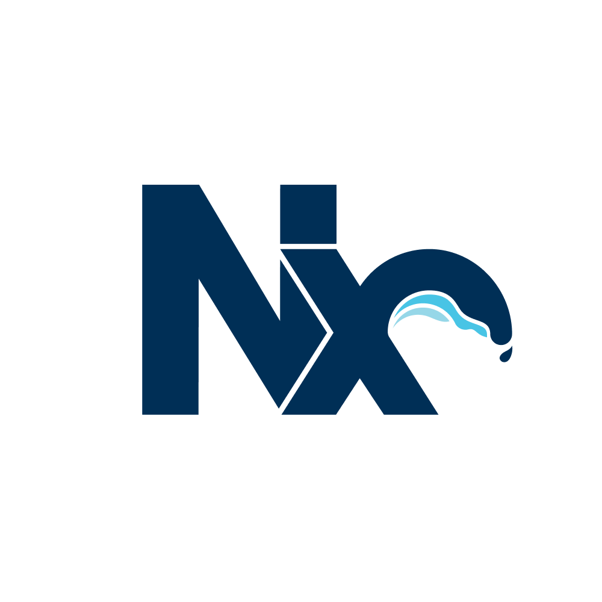

# nx-linaria

<p float="left" align="center" >
  
  
</p>

[](https://www.npmjs.com/package/nx-linaria)

> A [Nx](https://nx.dev/) Webpack plugin for enabling [Linaria](https://github.com/callstack/linaria) loader for babel projects.

# Installation

Add the plugin to your workspace:

```
npm i -D nx-linaria @linaria/core @linaria/react @wyw-in-js/babel-preset
```

_Compose the plugin in Webpack config:_

```ts
import { composePlugins, withNx } from "@nx/webpack";
import { withReact } from "@nx/react";
import { withLinaria } from "nx-linaria";

export default composePlugins(
  withNx(),
  withReact(),
  withLinaria(),
  (config) => {
    return config;
  }
);
```

_Include Linaria's babel preset in `.babelrc`:_

```json
{
  "presets": [
    [
      "@nrwl/react/babel",
      {
        "runtime": "automatic"
      }
    ],
    "@wyw-in-js"
  ],
  "plugins": []
}
```
